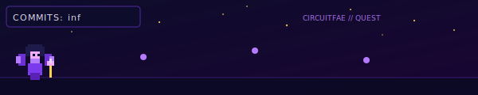

<small>CircuitFae · Civil + CS · NIT Warangal</small>

 

## CircuitFae

<table width="100%" align="center" cellpadding="0" cellspacing="0" border="0">
<tr>
<td width="6" bgcolor="#b57bff"></td>
<td style="padding:22px 26px; border:1px solid #7c3aed55; border-left:none; background-color:#0f0f26;">

ABOUT

Civil + CS at <strong style="color:#f0abfc;">NIT Warangal</strong> (CGPA 8.85 major · 8.75 minor)

</td>
</tr>
</table>

## Stack

<table width="100%" align="center" cellpadding="10" cellspacing="0" border="0">
<tr><td align="center">

</td></tr>
<tr><td align="center">

</td></tr>
<tr><td align="center">

</td></tr>
<tr><td align="center">
<code style="color:#b57bff;">DSA</code> · <code style="color:#b57bff;">OOP</code> · <code style="color:#b57bff;">DBMS</code> · <code style="color:#b57bff;">OS</code> · <code style="color:#b57bff;">LangChain</code> · AI/ML· full-stack 
</td></tr>
</table>

## Experience

<table width="100%" align="center" cellpadding="0" cellspacing="0" border="0">
<tr>
<td width="6" bgcolor="#f72585"></td>
<td style="padding:20px 24px; border:1px solid #7c3aed55; border-left:none; background-color:#0f0f26;">

RECENT ROLES

<strong style="color:#f0abfc;">Software Development Engineer Intern</strong> · Xelron AI · Bengaluru 
Dockerized debugging benchmarks for AfterQuery Pluto · 32 Python/Bash failure scenarios · 1,200+ pytest checks · 25 approved LLM eval benchmarks

<strong style="color:#f0abfc;">AI &amp; Cloud Technology Intern</strong> · AICTE Edunet Foundation · Remote · Sep–Oct 2025 
IBM SkillsBuild ML/AI training · designed &amp; shipped <a href="https://github.com/CircuitFae/AI-medichatbot-AURA-" style="color:#b57bff;">AURA</a> medichatbot end-to-end

</td>
</tr>
</table>

## Playground

  

  

    
    &nbsp;
    
  

  

    
  

  

    
    
  

## GitHub stats

 

### Dev quote

  <em>
    “Innovation distinguishes between a leader and a follower.”
  </em>

  — Steve Jobs

---

